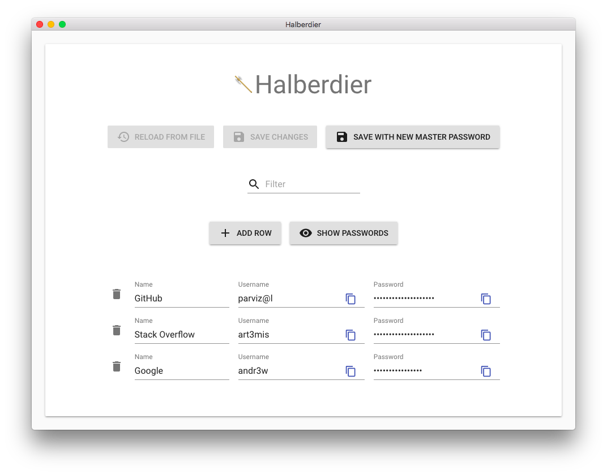

# Halberdier

A local (offline) password manager for Mac based on [Electron](https://electronjs.org/) (via
[electron-quick-start](https://github.com/electron/electron-quick-start)),
[Node.js crypto](https://nodejs.org/api/crypto.html), [React](https://reactjs.org/), and
[Material UI](https://material-ui-next.com/). Passwords are encrypted using AES-192.

# How to use this repo

If you don't have Yarn, then just replace `yarn` with `npm` in the following instructions.

1. `git clone https://github.com/a-n-d-r-3-w/halberdier.git`
1. `cd halberdier`
1. `yarn install`
1. Run webpack in watch mode: `yarn build`
1. In another terminal, launch app: `yarn start`

# Create an APP file for distribution

`yarn package`
